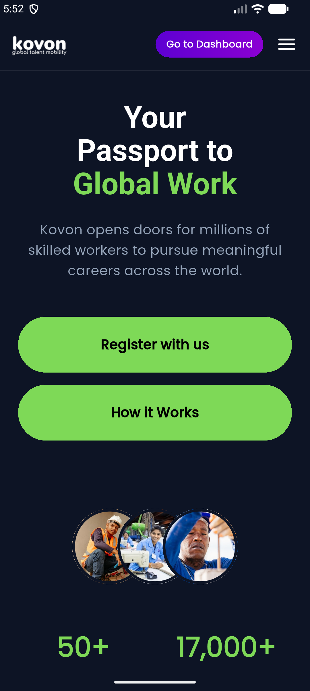
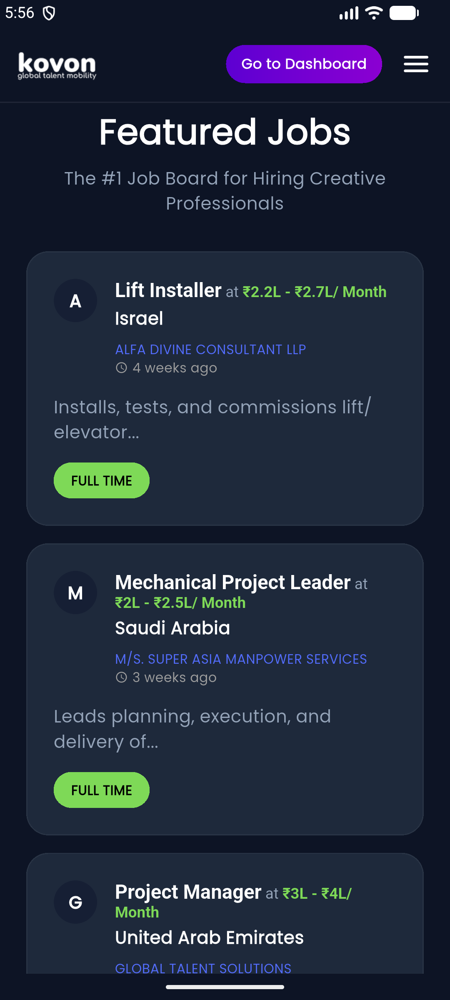
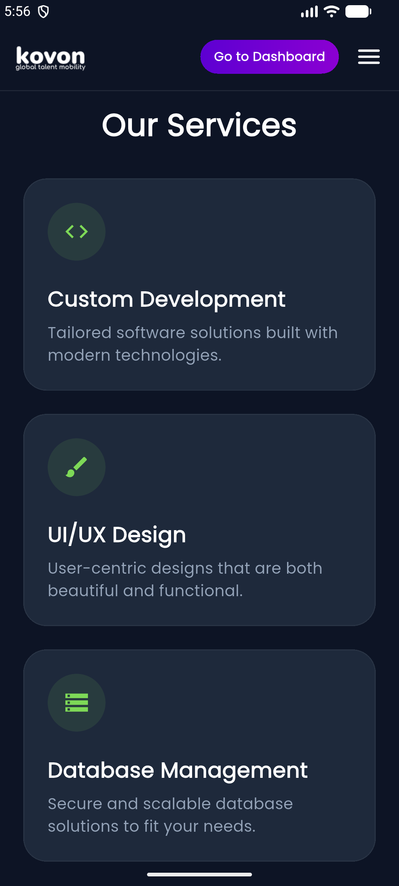
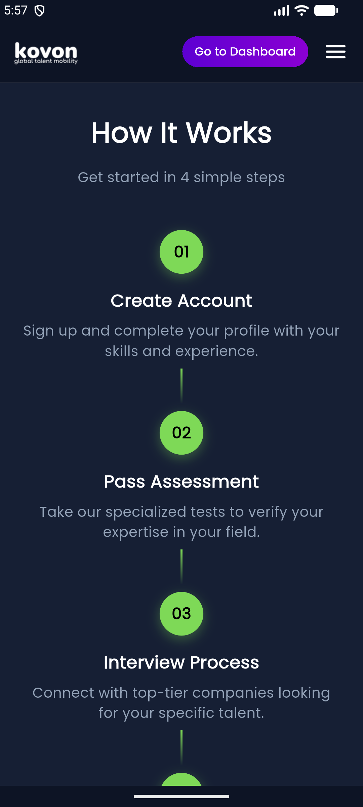
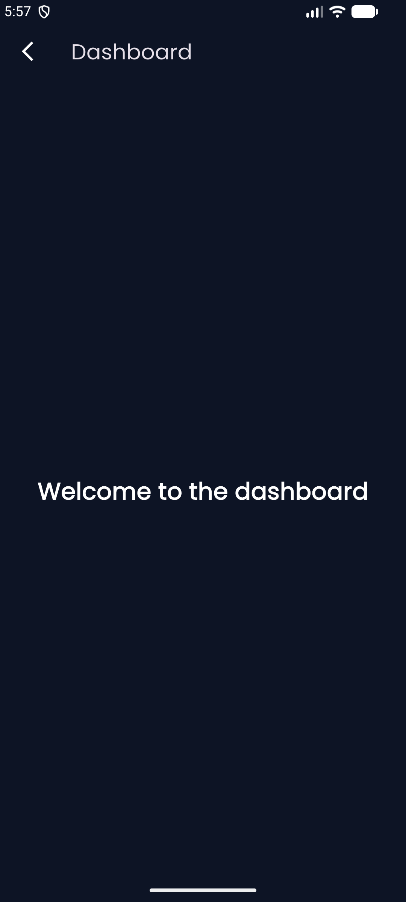

# 

# Kovon Mobile UI Replica - Hiring Assignment

A pixel-accurate mobile UI replica of the [Kovon.io](https://www.kovon.io) homepage built with Flutter.

## 🚀 How to Run the Project

1. **Clone the Repository:**
   ```bash
   git clone <repository-url>
   ```
2. **Navigate to Project Directory:**
   ```bash
   cd kovon
   ```
3. **Install Dependencies:**
   ```bash
   flutter pub get
   ```
4. **Run the Application:**
   ```bash
   flutter run
   ```

## 📸 Screenshots

 | Home Screen | Featured Jobs | Our Services |
 | :---: | :---: | :---: |
 |  |  |  |

 | How It Works | Dashboard |
 | :---: | :---: |
 |  |  |


## 🛠 Tech Stack & Requirements

- **Flutter Version:** `3.41.1` (Stable)
- **Dart SDK:** `^3.41.1`
- **Main Dependencies:**
  - `google_fonts`: For Poppins typography integration.
  - `cupertino_icons`: For iOS style icons.

## 📁 Folder Structure

The project follows a clean and modular folder structure as per the assignment requirements:

```text
lib/
├── main.dart                # Application entry point & theme configuration
├── screens/
│   ├── home_screen.dart     # Main landing page layout & section orchestration
│   └── dashboard_screen.dart # Dummy dashboard screen for navigation
├── widgets/
│   ├── header.dart          # Fixed top navigation bar
│   ├── hero_section.dart    # Branding & main CTA area
│   ├── feature_card.dart    # Reusable service/feature card
│   ├── job_card.dart        # Styled job listing card
│   ├── stats_section.dart   # Interactive statistics & worker avatars
│   ├── how_it_works_section.dart # Step-by-step process guide
│   └── footer_section.dart  # Company info & social links
└── utils/
    └── constants.dart       # Design tokens (Colors, Spacing, TextStyles)
```

## ✨ Mandatory Features Implemented

- **Fixed Header:** Stay at the top with logo and menu UI.
- **Hero Section:** Dark theme gradient, responsive tagline, and primary CTAs.
- **Services Section:** 4+ descriptive cards with custom iconography.
- **How It Works:** Vertically aligned step-by-step process.
- **Featured Jobs:** Realistic job cards with salary, location, and metadata.
- **Footer:** Full company information and social media icon placeholders.
- **Responsiveness:** Optimized for small (360px), medium, and large mobile devices.

## 🎁 Bonus Features Included

- **Google Fonts Integration:** Uses 'Poppins' for a modern feel.
- **Smooth Scrolling:** Enhanced with `BouncingScrollPhysics`.
- **Reusable Components:** Custom PrimaryButton and Card widgets.
- **Fixed Navigation:** Sticky header implementation.
- **Dummy Navigation:** Functional navigation from the header to the **Dashboard Screen**.

## 📲 APK Download

The compiled APK for testing on Android devices can be found here:
[Download Kovon.apk](./Kovon.apk)

---
*Developed as part of the Kovon Flutter Hiring Assignment.*
